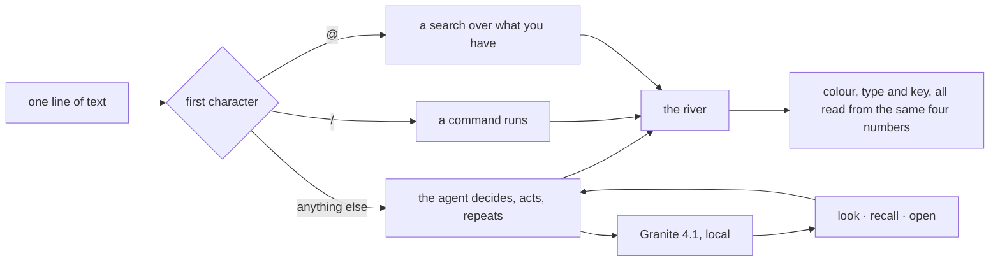

<p align="center">
  
</p>

# qi

[](LICENSE)
[](https://www.npmjs.com/package/@qi-ui/cli)
[](https://nodejs.org)
[](#requirements)

**A little AI, and everything it needs to be good company, living together in
about 3 GB on your Mac.**

qi is a fun experiment.

Take an AI small enough to live on a laptop — no cloud, no account, no key —
and build a little world around it: a harness that keeps it honest, and a page
that plays along.

Because here is the thing about small AIs: they are eager, and they make
things up.

So qi never takes its word for anything.

When it researches something, every quote has to actually appear in the page it
came from. If it made one up, the quote gets thrown out before you ever see it.

When it writes music — yes, it writes music — the song has to actually play.
Every sound is checked before you hear it.

And the page itself joins in. Write "ocean" and the word turns blue, because
oceans are blue. Every click and keystroke is a note in a key set by the mood
of the conversation, so the whole app sounds like one instrument that cannot
hit a wrong note.

```
/research    looks something up properly, leaves a note with sources
/present     the same, laid out as slides
/dj          writes a song and plays it underneath
/note /deck  the things you have made
@            find one of them
```

The model, its helpers, the checking, the page — all of it fits in about 3 GB
and runs entirely on your machine.

Nothing you type ever leaves it.

## Try it

```sh
npx @qi-ui/cli setup     # one question: which size
npx @qi-ui/cli run       # starts everything, opens the page
```

Or take the Mac app from [releases](https://github.com/qubie-org/qi/releases) —
one bundle, batteries included.

Two sizes: `3b` is the friendly default, `8b` answers better if your Mac has
the memory for it.

## How a turn works



Nothing hands raw text back to the model. Every result is compressed to a single
line before it reaches the agent, which is what lets a 3B model take several
steps without losing the thread.

## Requirements

- **Node 20+**, and `llama-server` on PATH (`brew install llama.cpp`).
- **8 GB of RAM** for `3b`, 16 GB for `8b`.
- **macOS on Apple silicon** for the standalone app, where `llama-server` runs
  on Metal with full GPU offload.

## Building from source

```sh
bun install
bash tools/pull.sh          # the weights, about 2.5 GB
bash tools/serve.sh         # llama-server on :8082
bun run dev
```

`bun run test` runs the suite; `native/build.sh` produces the Mac app.

## Known limitations

- Every number here was measured against `3b`. `8b` installs and is
  hash-verified but has not been run.
- `/dj` takes about 40 seconds to write a set. Without the strudel pack it
  arranges one from presets instead, instantly.
- Pictures are fetched and drawn directly rather than through the model, which
  declines to call the tool about as often as not.
- The Mac app signs ad-hoc by default. Point `QI_SIGN_ID` at a Developer ID for
  a notarizable bundle.
- Adapters are pinned to llama.cpp b10250.

## Licence

AGPL-3.0. See [LICENSE](LICENSE).

qi bundles [Lightpanda](https://github.com/lightpanda-io/browser), which is
AGPL-3.0, and that is the reason for the choice rather than an accident of it.
The Granite weights are Apache-2.0 and are IBM's, not covered by this licence.

## Credits

- [IBM Granite](https://huggingface.co/ibm-granite) — Granite 4.1, the RAG
  intrinsics and their activated variants, and Granite Embedding 30M.
- [llama.cpp](https://github.com/ggml-org/llama.cpp) — generation, tool calling
  and grammar-constrained decoding.
- [Lightpanda](https://lightpanda.io) — a headless browser for pages that only
  exist once their own JavaScript has run.
- [Strudel](https://strudel.cc) — the pattern language, and superdough, which
  synthesises every sound the interface makes.
- [SmolLM2](https://huggingface.co/HuggingFaceTB/SmolLM2-135M-Instruct) — the
  135M base behind the model that writes the sets.
- [Openverse](https://openverse.org) — CC-licensed imagery and audio that
  arrives with its creator and licence attached.
