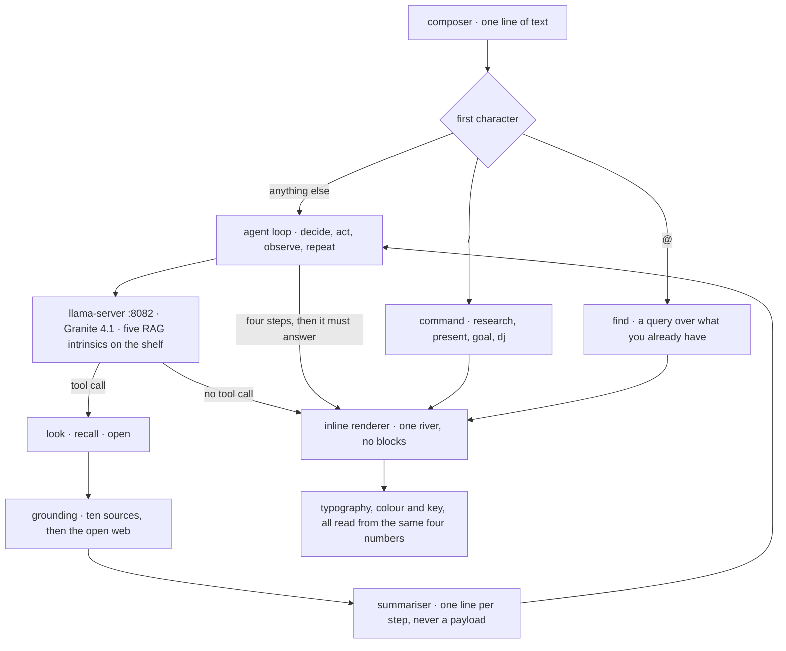
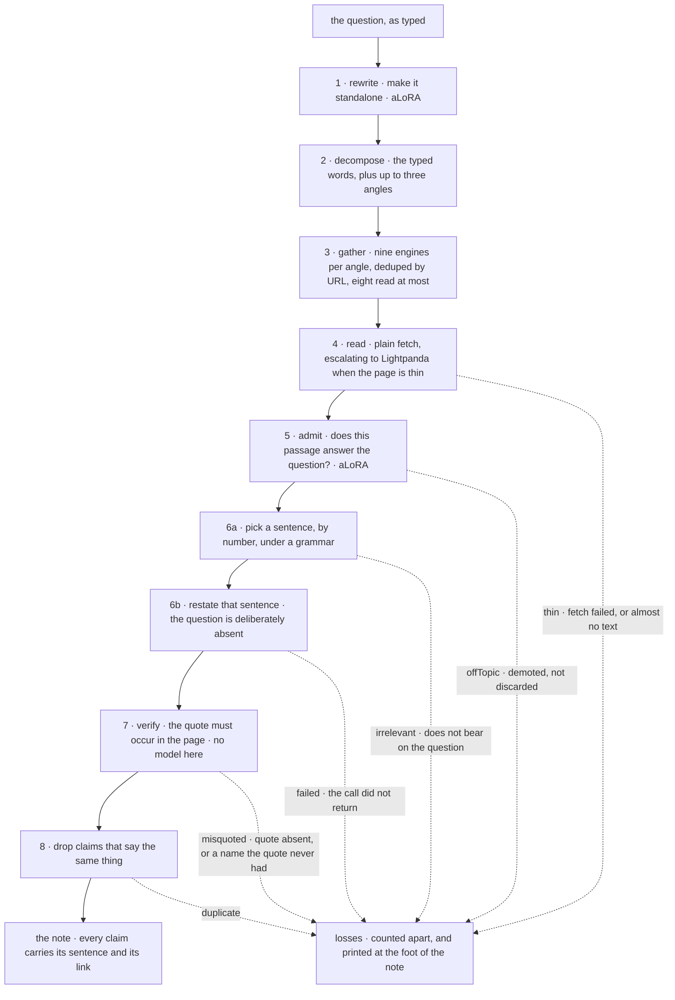

<p align="center">
  
</p>

# qi

[](LICENSE)
[](https://www.npmjs.com/package/@qi-ui/cli)
[](https://nodejs.org)
[](#requirements)

A text river with a 3B model in it, running on your own machine.

You type into one line. Answers arrive in the same line, inline, and the things
you can invoke are named rather than buried in menus. Nothing leaves the machine
unless you ask it to — the model, the embedder and the retrieval adapters all
run locally, and the only network traffic is the pages you asked it to read.

```
/research    investigates a question and leaves a note, with sources
/present     the same process, laid out as slides that carry their citations
/goal        keeps working until a second opinion agrees it is finished
/dj          writes a Strudel set and puts it on underneath the conversation
/note /deck  the things you have made
@            find one of them
```

## What this is

**A research project for learning about local LLMs.** Not a product — a place
to see how far a 3B model gets on real work when the process around it is built
to let it try things and then check them.

What it does:

- **Researches a question and leaves a note.** Nine engines per angle, pages
  read and gated, and every claim it keeps carries a quote that occurs
  *literally* in the page it cites. The comparison forgives curly quotes and
  stray spacing and forgives nothing else, so a paraphrase cannot become a
  citation.
- **Turns the same process into slides.** `/present` runs the research and lays
  it out as a deck where each slide still carries the sources behind it.
- **Keeps going until something else agrees it is done.** `/goal` works, then
  asks for a second opinion, and only stops when that opinion says so.
- **Composes music from a sentence.** `/dj` writes real Strudel — patterns,
  polyrhythm, chord voicings, delay — and puts a set on underneath the
  conversation. The interface re-tunes to its key while it plays.
- **Runs entirely on the machine.** The model, the embedder and the retrieval
  adapters are all local. The only network traffic is the pages you asked it to
  read.
- **Answers some questions without the model at all.** Weather, currency, a
  coin price, a picture — a shortcut past generation to the thing that actually
  knows, which is both faster and correct more often.

What it is allowed to do, which is the more interesting half:

The rule that came out of building this is **generate freely, then check
mechanically**. A small model is good at producing candidates and unreliable at
policing itself, so nothing here asks it to. It may say anything; what survives
is decided by code that has no model in it.

- The research process lets the model write any claim it likes, and keeps the
  ones whose quote is in the source.
- `/dj` lets it write any Strudel it likes, and plays the patterns whose sounds
  are registered, whose code evaluates against Strudel's own exports, and which
  produce events. Names it invents get swapped for real ones rather than
  throwing away the arrangement around them.
- Where a wrong answer can be made *unexpressible* rather than caught, it is:
  grammar-constrained struct-filling, a fixed vocabulary, a hard stop at a
  terminal token.

That split is why the model is given a long leash. Checking is cheap and
specific, so it can be trusted with the parts that need judgement — and the
parts that need to be right are not left to judgement at all.

The failures behind each of those decisions are written down in the code, next
to the fix they forced. `src/ground/research.ts` and `src/engine/verify.ts` are
the two worth reading.

**A creative, minimalist approach to UX.** There are no chat bubbles, no
sidebar, no settings panel and no message list. There is one river of text and
one line to type into. Models emit CommonMark whether you ask them to or not, so
every block construct is folded back into the river before the inline parser
sees it — headings keep their emphasis and lose their box, tables become cells
joined by a dot, a fenced block becomes inline code. Nothing is dropped; it
changes shape.

Two sigils. Under the first of them: four commands, two apps, and one shortcut
past the model. Typography, colour and sound are all derived from the same
reading of the conversation rather than configured. See
[The interface](#the-interface).

**Everything in one piece, on your machine.** One install, one directory, no
account and no key. `npx @qi-ui/cli setup` asks which size you want and fetches
it; the Mac app carries its own model server and puts the weights and the
conversation next to each other in Application Support, at paths you can find
and copy. The pack catalogue is one file that the installer and the app both
read, so the two can never disagree about what is on disk, and every download is
checked against a hash before it is used.

## Install

```sh
npx @qi-ui/cli setup     # choose a size, fetch it
npx @qi-ui/cli run       # start the model server and open the page
```

Or `npm i -g @qi-ui/cli`, then `qiui`. Weights land in `~/.qi`, or `QI_HOME`.
Downloads resume and are checked against a pinned hash.

| | model | install | needs | activated gate |
|---|---|---|---|---|
| `3b` | Granite 4.1 3B | 2.6 GB | ~8 GB RAM | yes |
| `8b` | Granite 4.1 8B | 6.1 GB | ~16 GB RAM | yes |

That last column is the one nobody thinks to ask about. IBM publishes each RAG
intrinsic twice: a plain LoRA, and an *activated* one that engages only after
its invocation tokens, which leaves the base model's KV cache for the prompt
valid. On `answerability` — which runs once per source read, eight times a
question — that is 16.98s against 0.04s per call. It is the difference between
the research process being affordable and not.

IBM ships the activated variants as safetensors only, so the GGUF conversions
are this project's own. Both sizes offered here have them.

Non-interactive:

```sh
qiui setup --model 8b --yes
```

Without a terminal and without `--yes`, setup refuses rather than guessing. A
command in a pipe should never move six gigabytes because nobody was there to
answer.

## Requirements

- **Node 20+.** The CLI has zero dependencies; Node 20 already has `fetch`,
  `readline/promises`, `createHash` and an HTTP server.
- **`llama-server` on PATH** — `brew install llama.cpp`. Generation, tool
  calling, JSON-schema grammars and adapter hot-swap all come from it, and it is
  the only runtime that offers all four.
- **RAM:** ~8 GB for 3b, ~16 GB for 8b. Context is 32k with an
  8-bit KV cache; Granite 4.1-3B's advertised 131k window would want ~10 GB of
  cache on top of the weights, which does not fit next to a browser.
- **macOS 15+ on Apple silicon** for the standalone app. `llama-server` runs on
  Metal with full GPU offload.
- **Lightpanda**, optionally, for pages that only exist after their own
  JavaScript has run. Without it, reads fall back to a plain fetch.

## How a turn works



Three verbs, deliberately. A small model's tool selection degrades sharply past
about five options — it starts picking the one whose description shares the most
words with the question rather than the one that would answer it. Packs add
more: `see` arrives with the vision pack, and the loop offers whatever is bound
rather than a fixed list.

Nothing returns raw text to the model. Every executor returns a string the
summariser compresses before it reaches the agent's context, so the agent
reasons over one-line results and never over a response body. That separation is
the whole reason a small model can run several steps without losing the thread.

The depth cap is four. It is not a safety rail so much as an admission: past
four steps this size of model stops making progress and starts restating the
question as a new tool call, and a cap produces a worse answer faster, which is
the better failure.

## Research that has to show its work

Asking a 3B model a question and printing the answer is a lookup. A lookup asks
one question once and believes the first thing that comes back. Research is the
same pieces in an order: ask several ways, read more than one source, keep only
what actually answers, make every claim point at the sentence it came from. None
of that is capability — it is order, and order is the one thing a 3B model
reliably will not impose on itself.



Step 7 is the one with no model in it, and it is the load-bearing one. A claim
whose quote is not a substring of its source is discarded, so a paraphrase
cannot become a citation and an invention cannot become a fact. Everything above
it is a suggestion; that part is true.

Three things about the diagram are worth saying out loud.

**The model no longer writes the quote.** Asking a model to copy does not make
it copy. The source is split into its sentences, they are offered as an
enumeration, and it picks one by number. The grammar admits only those numbers,
so the quote is verbatim by construction.

**The summarising call does not see the question.** Given a sentence and a
question that do not match, a model will reconcile them, and the sentence is the
only one of the two it is allowed to change — which is exactly how Hugging Face
acquired three schoolmates from Tsinghua. Whether the sentence bears on the
question at all was already decided one step earlier, where the whole page was
there to judge against. A second guard does not depend on a prompt at all: no
proper noun may appear in a claim that is not in its quote.

**The gate demotes rather than discards.** `offTopic` was 40% of every source
fetched across ten domains, far and away the largest loss. So its verdict is
obeyed while three other sources survive, and ignored below that. A note that
says nothing is not more accurate than a note with one good finding in it — it
is just empty, and emptiness reads as "there is nothing to know" rather than "I
declined to look".

The losses are counted separately for the same reason. One `rejected` number
could not say whether seven of eight sources were unreachable, off-topic, or
fine-but-misquoted, and those have three different fixes. The note prints them:
a note listing only what it found reads as complete whether or not it is, and
"this is what there is" and "this is what I could get" are different claims.

### The evaluation

The process was built against machine-learning papers — six prompts, one
domain — and several decisions carry the shape of that: the LaTeX stripper
exists because of arXiv, the sentence-length bounds are paper prose, first-person
text was read as opinion when an interview or a field report *is* first person.
Each was a reasonable call on the evidence available. The evaluation exists to
widen that evidence.

`src/ground/__tests__/domains.ts` is 22 terse questions across ten domains,
grouped by which part of the pipeline each one stresses rather than by subject:
recency, health, law, disputed history, procedures, marketing copy,
disambiguation, time-sensitive finance, and four combinatorial questions where
no single page answers and the note only works if claims from different sources
compose. That last group is the case the whole process exists for, and nothing
had ever tested it.

It produces a report, not a gate. There is no correct number of claims for "why
did the bronze age collapse", and a threshold there would be a number invented
to be met. What it *can* decide mechanically are the overfitting tells — a claim
that restates its own quote, a quote too short to be evidence, page chrome
quoted as a finding — counted per domain, because if they cluster in one group
that group is where the paper-shaped assumptions broke.

It reaches real endpoints and takes tens of seconds a question, so it is not in
CI. It is driven in slices from outside, and each slice hands its results back
rather than only accumulating them: the app died on question fourteen of
twenty-two once — Lightpanda segfaulted on a chrome-heavy page — taking fifteen
minutes of real network traffic with it.

## The interface

**Inline only.** `src/inline/downgrade.ts` folds every block construct back into
the river before the parser runs. Headings become `loud` text. Tables become
cells joined by a dot. A thematic break becomes a breath with a dot in it. Lists
keep their ordering and lose their box — no `<ul>`, no `<li>`, no margins.
Anything that fails to parse degrades to literal text rather than throwing; a
malformed `[[` should look like two brackets, not blow up the page.

**Two sigils, from four.** `/` runs a thing you invoke. `@` is a query over what
you already have. `$` was a skill namespace — a folder with a brief, loaded into
the model's context when summoned. It is exactly how Claude skills work and it
is a good design for a model that can be handed prose and trusted to act on it.
This app runs a 3B model, and a brief saying "write a deck" is latitude, which
is the thing every working fix here has removed. The mechanism was complete,
wired into the agent loop, and held zero skills for the entire life of the
codebase. `#` was search, and it went when `@` stopped being a registry of apps
and became the query instead. Deleting an abstraction that never acquired an
instance is not a loss of capability; it is the removal of a thing that had to
be explained.

**Colour means something or is absent.** Each accented word is embedded and
matched against colour concepts, so "ocean" is blue because oceans are blue,
"fire" is red because fire is red, "forest" is green. The palette is four fixed,
saturated tones measured in OKLCH and never interpolated between. A word with no
colour association gets none — the earlier design rotated a hue per conversation
and painted every accent with whatever came out, which varies without
signifying. Glyph placement works the same way, against a bank of motif
prototypes, with the threshold measured rather than chosen. No model is involved
and nothing is sampled: the same sentence always decorates the same way.

**Sound is musical, not decorative.** The conversation is read as four numbers —
warmth, energy, gravity, wonder — each a direction in embedding space between
two poles, folded into a running state with decay so the room drifts rather than
flips. Those same four numbers pick a tonic, a mode, a timbre and a tempo, and
every sound the interface makes is a degree of that scale, synthesised when it
plays. Two things follow. Nothing can clash, because there is no interval
available that is not in the scale. And there is exactly one exception: `miss`
is a flat second below the tonic, the sharpest dissonance in the system and not
a scale tone in any mode here, which makes it the only sound in the app that
carries information. Consonance is just the sound of things working.

This replaced twelve generated WAVs. Every one had a pitch baked into it, none
of them knew about each other, and a keystroke tick under a callout chime
produced whatever interval the two happened to have been born with. Usually a
bad one. They were also 204 KB to fetch, decode and keep decoded; an oscillator
and an envelope are neither.

`/dj` pins the key while a set plays — a bassline is holding a tonic, and
letting a sad question lower it underneath would be heard as a fault rather than
as responsiveness. The tonic stays where the conversation had it and only the
mode changes, so starting a set does not transpose the room out from under
whatever was just said.

## Repository layout

| | |
|---|---|
| `src/inline/` | the river: block-downgrader, inline parser, renderer, chip placement |
| `src/engine/` | vibe, palette, key, sound, glyph placement — everything read from the conversation |
| `src/agent/` | the loop, the three core verbs, the step summariser |
| `src/ground/` | search engines, page reading, the ten sources, the sandbox, the research process, the domain eval |
| `src/pages/` | the sigil namespaces, the `qi:` address space, `@` search |
| `src/commands/` | one folder per command: `COMMAND.md` frontmatter and prose, `command.ts` |
| `src/apps/` | one folder per app: `APP.md`, `app.tsx`. `note` and `deck` |
| `src/model/` | the llama-server client, `catalog.json`, pack bindings, telemetry |
| `src/packs/` | optional weights: the five RAG intrinsics, the embedder, the vision pack |
| `src/store/` | SQLite over OPFS, notes and decks, the working set rebuilt each step |
| `cli/` | `@qi-ui/cli` — the setup wizard, the model plan, the runner. Zero dependencies |
| `native/` | the Mac app: loopback HTTP server, model supervision, resumable installs, Sparkle |
| `tools/` | `pull.sh`, `serve.sh`, `check.sh`, the headless renderer, the pack builders |
| `skills/`, `plugin.json`, `mcp.json` | an [Agent Plugin](https://agent-plugins.org) — seven progressive-disclosure skills for an agent working on this repository, and the MCP server that drives the running app |
| `train/`, `.stage/` | earlier research lanes — the pre-Granite stack and an HDC bench. Nothing in the app imports them |

## Building from source

```sh
bun install
bash tools/pull.sh          # the weights, about 2.5 GB
bun run dev                 # the page
bash tools/serve.sh         # the model server
bash tools/check.sh         # four claims the stack is built on, over curl
```

For a standalone app:

```sh
npx vite build
bash native/build.sh        # → native/Qi.app
```

`native/build.sh` walks llama-server's dylib closure and rewrites it to
`@rpath`, so the app carries its own model server rather than depending on a
Homebrew tree. Signing is inside-out and never `--deep`: a nested executable
must carry its own signature before the bundle is sealed around it, and `--deep`
produces something that notarizes and then refuses to launch.

`QI_BUNDLE_PACKS=1` bundles the weights and needs no network at all. The default
installs them to Application Support on first run, resumable across four byte
ranges and verified against the hashes in `src/model/catalog.json` — a corrupt
GGUF has been downloaded here once, and `llama-bench` benchmarked it perfectly
happily.

The page is served over loopback rather than `file://` because the wasm sandbox
needs a SharedArrayBuffer, which the browser only hands to a cross-origin
isolated document, and isolation is granted on the strength of response headers
that `file://` has no responses to carry.

## Known limitations

Current, and none of them a surprise — this is a 3B model on a laptop.

- Every number here was measured against `3b`. `8b` installs and is
  hash-verified but has not been run.
- `/dj` writes a set in about 40 seconds on the wasm backend. Without the
  strudel pack it arranges one from presets instead, instantly.
- The answerability gate is right about half the time. It is right about the
  cases that matter most, and the note says what it discarded and why.
- Pictures are retrieved and drawn directly rather than through the model,
  which declines to call the tool about as often as not.
- The Mac app signs ad-hoc by default. Point `QI_SIGN_ID` at a Developer ID for
  a notarizable bundle; nothing here submits it for you.
- Adapters are pinned to llama.cpp b10250. `--lora-init-without-apply` does not
  hold in that build, so the app zeroes every scale itself once the server
  answers.
- 30b is not offered. Its download plan carried no checksums, and an
  unverifiable 17.5 GB fetch is not worth the convenience.

## Licence

AGPL-3.0. See [LICENSE](LICENSE).

qi bundles [Lightpanda](https://github.com/lightpanda-io/browser), which is
AGPL-3.0, and that is the reason for the choice rather than an incidental
consequence of it. The Granite weights are Apache-2.0 and are IBM's, not covered
by this licence — see [ibm-granite](https://huggingface.co/ibm-granite).

## Credits

- [IBM Granite](https://huggingface.co/ibm-granite) — Granite 4.1 at three
  sizes, the five RAG intrinsics and their activated variants, and Granite
  Embedding 30M.
- [llama.cpp](https://github.com/ggml-org/llama.cpp) — generation, tool calling,
  grammar-constrained decoding and the adapter shelf.
- [Lightpanda](https://lightpanda.io) — a headless browser for pages that only
  exist after their own JavaScript.
- [Strudel](https://strudel.cc) — superdough, which synthesises every sound the
  interface makes.
- [Openverse](https://openverse.org) — CC-licensed imagery that arrives with its
  creator and its licence attached, which is the only kind that can be shown
  without lying about where it came from.
